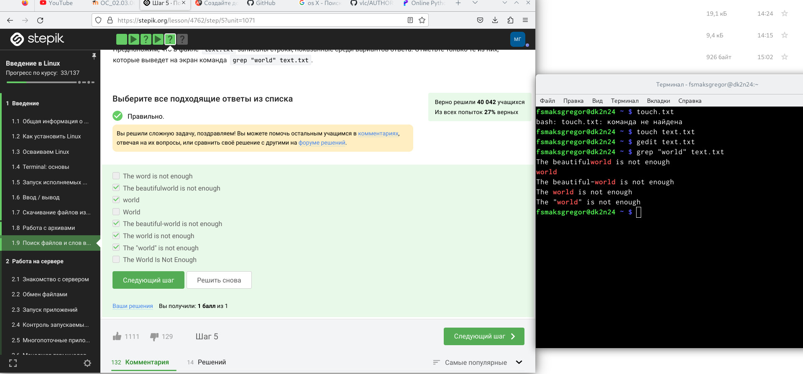
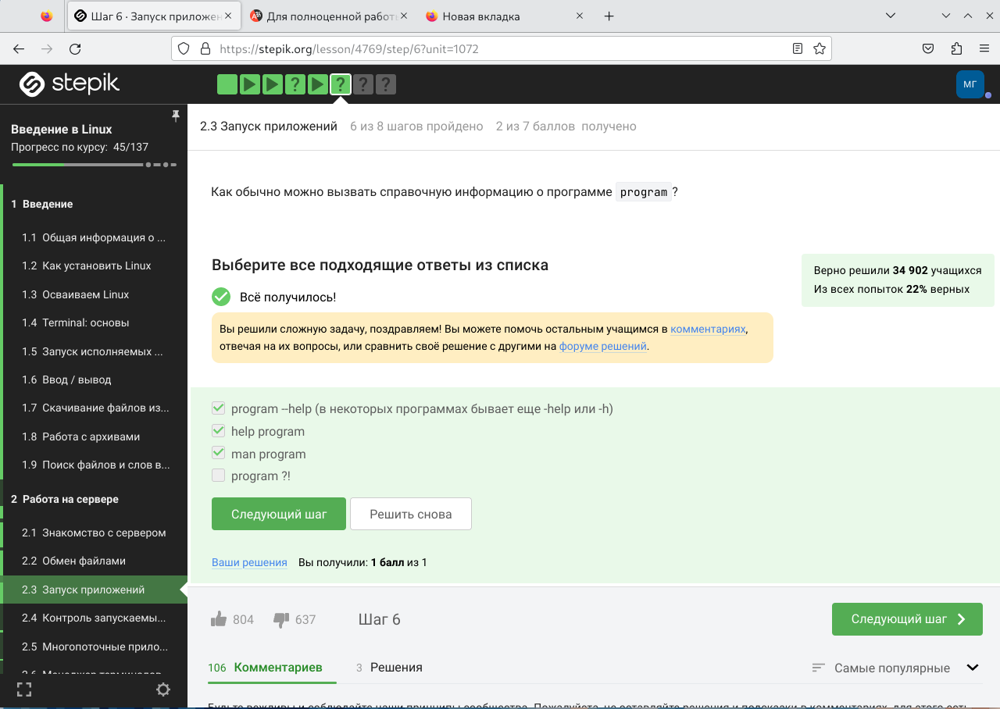
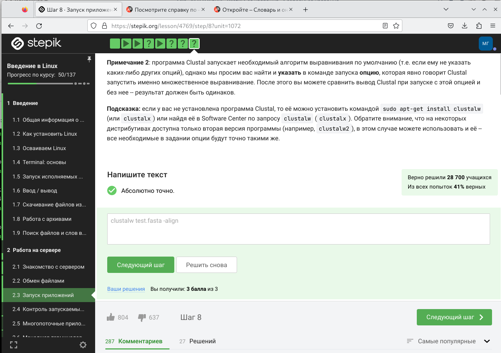
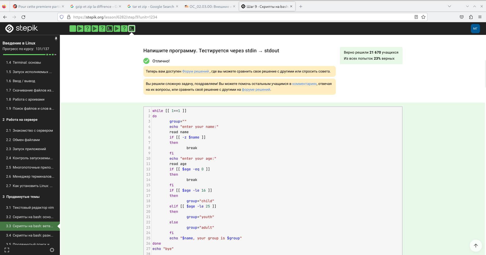
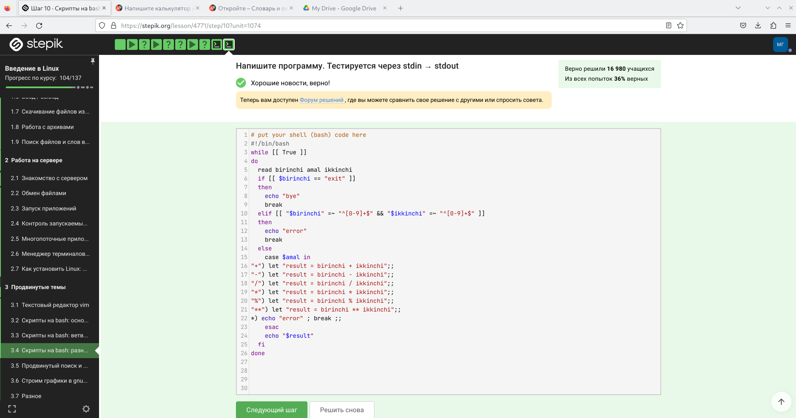
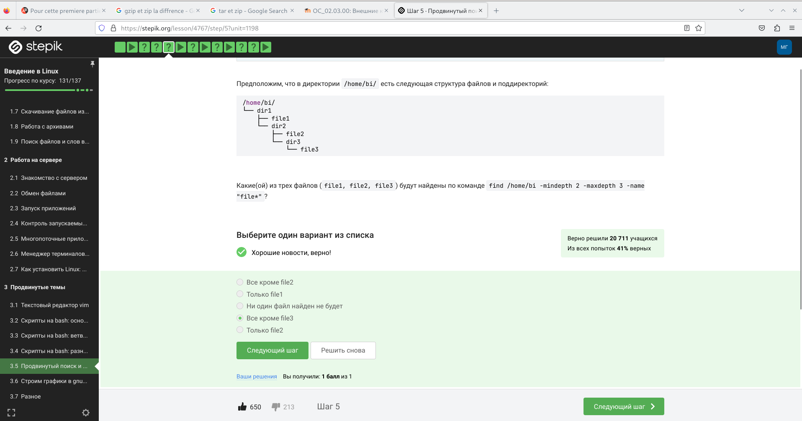

---
## Front matter
title: "Отчет 1,2 и 3  "
subtitle: "Linux"
author: "Силвен Макс Грегор Филс , НКАбд-03-22"

## Generic otions
lang: ru-RU
toc-title: "Содержание"

## Bibliography
bibliography: bib/cite.bib
csl: pandoc/csl/gost-r-7-0-5-2008-numeric.csl

## Pdf output format
toc: true # Table of contents
toc-depth: 2
lof: true # List of figures
lot: true # List of tables
fontsize: 12pt
linestretch: 1.5
papersize: a4
documentclass: scrreprt
## I18n polyglossia
polyglossia-lang:
  name: russian
  options:
	- spelling=modern
	- babelshorthands=true
polyglossia-otherlangs:
  name: english
## I18n babel
babel-lang: russian
babel-otherlangs: english
## Fonts
mainfont: PT Serif
romanfont: PT Serif
sansfont: PT Sans
monofont: PT Mono
mainfontoptions: Ligatures=TeX
romanfontoptions: Ligatures=TeX
sansfontoptions: Ligatures=TeX,Scale=MatchLowercase
monofontoptions: Scale=MatchLowercase,Scale=0.9
## Biblatex
biblatex: true
biblio-style: "gost-numeric"
biblatexoptions:
  - parentracker=true
  - backend=biber
  - hyperref=auto
  - language=auto
  - autolang=other*
  - citestyle=gost-numeric
## Pandoc-crossref LaTeX customization
figureTitle: "Рис."
tableTitle: "Таблица"
listingTitle: "Листинг"
lofTitle: "Список иллюстраций"
lotTitle: "Список таблиц"
lolTitle: "Листинги"
## Misc options
indent: true
header-includes:
  - \usepackage{indentfirst}
  - \usepackage{float} # keep figures where there are in the text
  - \floatplacement{figure}{H} # keep figures where there are in the text
---

# Цель работы

- Yметь пользоватся системой Linux

# Теоретическое введение

- Linux — это семейство операционных систем (ОС), работающих на основе одноименного ядра. Нет одной операционной системы Linux, как, например, Windows или MacOS. Есть множество дистрибутивов (набор файлов, необходимых для установки ПО), выполняющих конкретные задачи.
- Где нужен Linux? - Веб-серверы Дистрибутивы Linux практически полностью захватили рынок веб-серверов. Согласно рейтингу аналитического агентства W3Techs, на Linux-серверах развернуты 75,1% сайтов. - Мобильные устройства ОС
- Android работает на ядре Linux, поэтому она используется и в мобильных устройствах. - Суперкомпьютеры Это специализированные вычислительные машины, превосходящие по своим техническим параметрам и скорости вычислений многие обычные компьютеры. Они уникальны, для многих из них требуется особая ОС, способная решать конкретные задачи. Благодаря открытому исходному коду разработчики могут видоизменять ОС так, чтобы она работала и на таких машинах. 
- Игровые консоли Linux занял свою нишу и в игровых консолях, но ориентированных на эту ОС игр пока не так много. Компания Steam работает над исправлением ситуации — разрабатывает операционную систему SteamOS. Она будет поставляться вместе с игровой консолью Steam Machine. 
- Устройства IoT и умная техника Многие из них созданы на основе Linux. Так, компания Samsung разработала операционную систему Tize, LG — WebOS, а Panasonic и Philips используют FirefoxOS. - Авиация и транспорт Во встроенных компьютерах Tesla и машинах с автопилотами Google используется операционная система Linux. ПО для отслеживания трафика в США аналогично разработано на этой ОС,а администрация авиации Америки перешла на нее еще в 2006 году.

# Прохождение курса

## Введение в Linux 
(рис. @fig:031).

{#fig:031 width=70%}

1. Введение Вопрос: как называется этот курс? Чтобы ответить, выберите правильный ответ нажмите на зелёную кнопку ниже.

- Здесь курс называется Введение в Linux, поэтому мы выбираем ответ : введение в Linux.(рис. @fig:001).

{#fig:001 width=70%}

2. Мы читаем текст и выбираем правильные ответы

(рис. @fig:002)

{#fig:002 width=70%}

3. Как установить Linux. Какую операционную систему вы обычно используете? В таких типах задания (с галочками/чекбоксами/checkbox) вы можете выбирать несколько вариантов ответа (от 0 до всех)!

- В настоящее время я использую Mac Os, поэтому я выбрал систему OS X (рис. @fig:003).

{#fig:003 width=70%}

4. Что такое виртуальная машина? Выберите наиболее подходящий ответ! В таком типе заданий (с радиокнопками/radio button) ответ всегда ровно один!

- Виртуализация позволяет использовать операционные системы в таком приложении, как virtualbox(рис. @fig:004). 

{#fig:004 width=70%}

5. Смогли ли вы запустить на своем компьютере Linux?(рис. @fig:005).

{#fig:005 width=70%}

6. Создайте документ в OpenOffice/LibreOffice Writer (аналог Microsoft Word) и напишите в нём шрифтом FreeMono (если такого шрифта у вас нет,то используйте Arial или Times New Roman) одну-единственную строчку: Hello, Linux! После этого сохраните этот документ в формате XML (Microsoft Word 2003 XML) или в формате FODT (OpenDocument Text: Flat XML) и загрузите в форму ниже.

- Мы только следили за этапами (рис. @fig:006).

{#fig:006 width=70%}

7. Какое расширение имеют установочные пакеты в Linux (Ubuntu)?(рис. @fig:007).

{#fig:07 width=70%}

8. Поставьте себе в систему плеер VLC (любым способом: через Software Center или скачиванием установочного пакета с сайта VLC). Запустите, откройте Help About (или Shift+F1) и напишите ниже первую фамилию (без имени!) из вкладки Authors. Обратите внимание, что в англоязычных текстах обычно имя стоит на первом месте (first name), а фамилия на втором (last name).(рис. @fig:008).

{#fig:008 width=70%}

9. Для чего можно использовать приложение Update Manager?(рис. @fig:009).

{#fig:009 width=70%}

10. Terminal: основы
Выберите все синонимы для “командной строки”.(рис. @fig:0010).

{#fig:0010 width=70%}

11. Какая команда напечатает в какой директории мы сейчас находимся?(рис. @fig:0011).

{#fig:0011 width=70%}

12. Укажите, какие из следующих команд полностью эквивалентны команде ls -A
–human-readable -l /some/directory (рис. @fig:0012).

{#fig:0012 width=70%}

13. Предположим, что вы находитесь в директории /home/bi/Documents, причем
/home/bi — ваша домашняя директория. Какая(ие) команда выведет содержимое
/home/bi/Downloads, при этом не показывая содержимое других директорий?(рис. @fig:0013).

{#fig:0013 width=70%}

14. Какая команда используется для удаления директорий?(рис. @fig:0014).

{#fig:0014 width=70%}

15. Запуск исполняемых файлов Что произойдет, если ввести в терминал команду firefox (для запуска одно-
именного браузера), а затем ввести туда же команду exit?(рис. @fig:0015).

{#fig:0015 width=70%}

16. Чему эквивалентен запуск программы с &?(рис. @fig:0016).

{#fig:0016 width=70%}

17. Скачайте файл с программой, сделайте его исполняемым, запустите и скопируйте то, что он выведет на экран, в форму ниже.

- Мы поместили инструкции в онлайн-ридер python, и терминал этого компилятора выдал нам этот ответ.(рис. @fig:0017).

{#fig:0017 width=70%}

18. Ввод / вывод Куда по умолчанию выводится поток ошибок из программы, запущенной в терминале?(рис. @fig:0018).

{#fig:0018 width=70%}

19. Какие (какая) из команд создадут файл file.txt и запишут в него поток ошибок программы program? Считайте, что в момент запуска программы файл file.txt не существует(рис. @fig:0019).

{#fig:0019 width=70%}

20. Куда деваются сообщения об ошибках (т.е. вывод в stderr) от тех программ, которые объединены в конвейер (pipe)?(рис. @fig:0020).

{#fig:0020 width=70%}

21. Скачивание файлов из интернета В каком файле на диске окажется картинка, если для её скачивания были выполнены следующие команды?
cd /home/alex/ wget -P /home/alex/Pictures -O 1.png http://example.com/example.png(рис. @fig:0021).

{#fig:0021 width=70%}

22. Какую опцию нужно указать команде wget, чтобы она не выводила никаких сообщений на экран (Resolving.., Connecting to.. и т.д.)? 

- Ни один из других ответов недействителен(рис. @fig:0022).

{#fig:0022 width=70%}

23. Пусть на некоторой web-странице есть ссылки на картинки в форматах png и png, а также ссылки на другие страницы сайта (обычные html файлы). Какие файлы будут скачаны на компьютер, если запустить wget -r -l 1 -A png и передать в качестве аргумента ссылку на эту web-страницу? Выберите наиболее полный ответ! (рис. @fig:0023).

{#fig:0023 width=70%}

24. Работа с архивами Чем отличаются архиваторы gzip и zip?

- Gzip работает быстрее, чем ZIP, при сжатии и распаковке. ZIP - это инструмент архивации и сжатия в одном флаконе, в то время как Gzip нуждается в помощи команды Tar для архивирования файлов. Gzip может сэкономить больше места на диске, чем приложения для сжатия ZIP-файлов. Как Gzip, так и ZIP используют алгоритм сжатия DEFLATE.(рис. @fig:0024).

{#fig:0024 width=70%}

25. Какие из перечисленных программ-архиваторов могут создать архив из директории с файлами?

- Оба являются компрессорами, а также позволяют архивировать документы.(рис. @fig:0025).

{#fig:0025 width=70%}

26. Какой набор опций нужно указать программе tar, чтобы запаковать файлы в
my_archive.tar.bz2?(рис. @fig:0026).

{#fig:0026 width=70%}

27. Мы использовали терминал и загрузили папку с помощью команды wget, затем мы использовали команду tar для распаковки загруженного файла и получили следующий результат.(рис. @fig:0027).

{#fig:0027 width=70%}

28. Какая маска команды find НЕ найдет файл Alexey.jpeg?(рис. @fig:0028).

{#fig:0028 width=70%}

29. Предположим, что в файле text.txt записаны строки, показанные среди вариантов ответа. Отметьте только теизних, которые выведет на экран команда grep “world” text.txt.
- мы использовали терминал нашего компьютера, вводили разные тексты и отмечали правильные ответы(рис. @fig:0029).

{#fig:0029 width=70%}

30. Cкачайте архив с произведениями Шекспира. Вам нужно сгенерировать файл, в котором будут все строчки из этих произведений, содержащие “love”, и загрузить этот файл в форму.

- Мы внесли необходимую информацию в файл outlog.txt затем загрузите на сайт(рис. @fig:0030).

{#fig:0030 width=70%}

## Работа на сервере

1. Для каких задач можно использовать удаленный сервер?(рис. @fig:0031).

{#fig:0031 width=70%}

2. Предположим программа ssh-keygen создала вам два ключа: id_rsa и id_rsa.pub.
Какой из этих ключей можно без опаски пересылать по интернету?(рис. @fig:0032).

{#fig:0032 width=70%}

3. Какая команда скопирует на сервер (в домашнюю директорию) папку stepic
вместе с содержимым ее самой и всех ее подпапок?(рис. @fig:053).

{#fig:0053 width=70%}

4.  Предположим, что вы устанавливаете программу program на свой компьютер при помощи команды sudo apt-get install program. Терминал сообщает вам, что он не может найти и скачать установочный пакет. Какие действия могут устранить проблему?(рис. @fig:0034).

{#fig:0034 width=70%}

5. Для чего можно использовать программу Filezilla? (рис. @fig:004).

{#fig:004 width=70%}

6. Что можно сделать, если требуется запустить на сервере программу, для работы которой нужен не терминал, а экран?(рис. @fig:0035).

{#fig:0035 width=70%}

7. Как обычно можно вызвать справочную информацию о программе program(рис. @fig:0036).

{#fig:0036 width=70%}

8. Посмотрите справку по программе FastQC (имеется ввиду вариант для запуска в терминале) и определите, какие форматы данных он может принимать на вход.
Если вы хотите попробовать запустить FastQC на каких-то реальных данных, то
можете попробовать на этом файле.(рис. @fig:0037).

{#fig:0037 width=70%}

9. Посмотрите справку по программе (имеется в виду версия для терминала) и впишите в поле ниже команду, которая запускает в терминале Clustal на файле test.fasta и выполняет множественное выравнивание (multiple alignment). Никакие лишние опции указывать не нужно (только необходимые для выполнения этого задания)!(рис. @fig:0038).

{#fig:0038 width=70%}

10. Контроль запускаемых программ
Предположим вы запустили программы program1, program2 и program3 в фоновом режиме. После этого вы выполнили следующие действия: fg %1 Ctrl+С fg%2 Ctrl+Z jobs
Информация о каких программах будет показана при выполнении команды
jobs(рис. @fig:0039).

{#fig:0039 width=70%}

11. В каждой из этих трех утилит для каждой запущенной программы указывается число-идентификатор. Одинаковые
ли эти идентификаторы в jobs, top и ps? (рис. @fig:0040).

{#fig:0040 width=70%}

12. С помощью какой команды можно мгновенно завершить остановленный про-
цесс?(рис. @fig:0041).

{#fig:0042 width=70%}

13. Что произойдет, если использовать kill (без опций) по отношению к процессу,
который был приостановлен при помощи Ctrl+Z? (рис. @fig:0043).

{#fig:0043 width=70%}

14. Многопоточные приложения Сколько вычислительных ресурсов центрального процессора (% CPU) использует остановленное (по Ctrl+Z) многопоточное приложение? Учитывайте, что 100% CPU означает загрузку одного процессора, 200% CPU – двух процессоров (на многопроцессорных и/или многоядерных компьютерах) и т.д. Например, выполняющееся в 4 потока приложение обычно использует около 400% CPU, однако наш вопрос касается именно момента после остановки такого приложения.(рис. @fig:0044).

{#fig:0044 width=70%}

15. Сколько памяти занимает остановленное (по Ctrl+Z) многопоточное прило-
жение? Подсказка: если вы не знаете как ответить на этот вопрос, то можете
попробовать запустить многопоточное приложение на своем компьютере и по-
смотреть на результат с помощью команды top. Если вы не знаете примеров
таких приложений, то рекомендуем вам ненадолго отложить этот шаг и досмот-
реть занятие до конца. В следующих видеофрагментах и заданиях будет показан
пример многопоточного приложения (программы bowtie2). Тестовые данные
для запуска этой программы можно найти в последнем задании этого урока.(рис. @fig:0045).

{#fig:0045 width=70%}

15. Как принудительно завершить один из потоков запущенного многопоточного приложения?(рис. @fig:0046).

{#fig:0046 width=70%}

16. Для выполнения этого задания вам потребуется программа bowtie2.
Надеемся, что вы разобрались, что запуск bowtie2 состоит из двух шагов –сначала запускаем подпрограмму bowtie2-build, а затем подпрограмму bowtie2.
Изучите справочную информацию об этих подпрограммах (можно вызвать при помощи –help) и ответьте на вопрос какой(ие) из этих шагов можно выполнить в несколько потоков? (рис. @fig:0047).

{#fig:0047 width=70%}

17. Скачайте файлы, необходимые для запуска bowtie2: референсный геном
(reference) и риды (reads). Запустите программу bowtie2 на этих данных (напоминаем, что запуск состоит из двух этапов!). Вывод stderr второго этапа (т.е. запуск подпрограммы bowtie2) запишите в файл (см. занятие про перенаправление ввода/вывода) и загрузите его в форму ниже. Мы также рекомендуем вам перенаправлять вывод stdout в файлы на обоих этапах, чтобы он не засорял экран вашего терминала.Попробуйте теперь запустить второй этап (запуск подпрограммы bowtie2) в несколько потоков. Рекомендуем выставить число потоков равное количествуядер на вашем компьютере (команда nproc). Сравните скорость выполнения в таком режиме с работой в один поток. Также рекомендуем убедиться, что результаты запусков (т.е. вывод в stderr) полностью совпали в обоих режимах!(рис. @fig:0048).

{#fig:0048 width=70%}

18. Менеджер терминалов tmux
Вы открыли две вкладки в терминале. В одной из них вы запустили процесс и
приостановили его. Переключившись во вторую вкладку и набрав fg, вы добьетесь
следующего:(рис. @fig:0049).

{#fig:0049 width=70%}

19. Предположим, что в tmux осталась последняя открытая вкладка. Что произойдет, если вы введете в этой вкладке в командную строку команду exit?(рис. @fig:0050).

{#fig:019 width=70%}

20. Предположим, что вы открыли терминал, зашли в нем на сервер, запустили
на этом сервере tmux и начали работу в нем. Что произойдет, если вы теперь
закроете терминал?(рис. @fig:0050).

{#fig:0050 width=70%}

21. Что произойдет, если запустить процесс в фоновом режиме в одной из вкладок
tmux, а затем принудительно закрыть эту вкладку (Ctrl+B, X)?(рис. @fig:0051).

{#fig:0051 width=70%}

22. Изучите справку по tmux (например, man tmux) и выберите из предложенных
ниже tmux-команд ту, которая отвечает за переименование текущей вкладки.(рис. @fig:0052).

{#fig:0052 width=70%}

23. Кроме создания нескольких вкладок, tmux умеет еще и разделять (split) одну
вкладку на несколько, например, горизонтальной чертой на верхнюю и нижнюю
или вертикальной чертой на левую и правую. Разделение может быть полезно,
например, чтобы запустить процесс в верхней половине вкладки, а продолжить
работу в нижней и одновременно следить за тем, что происходит с процессом. Для
“горизонтального” разделения используется (Ctrl+B и “), а для”вертикального” –(Ctrl+B и %).
Предлагаем вам самостоятельное изучить работу с “вкладками внутри вкла-
док” и отметить верные утверждения из списка ниже. Вы можете использовать
справку по tmux (например, man tmux) или просто попробовать воспроизвести
эти утверждениях у себя на компьютере.(рис. @fig:0054).

{#fig:0054 width=70%}

## Продвинутые темы

1. Текстовый редактор vim Какую клавишу(и) нужно нажать на клавиатуре, чтобы выйти из редактора vim? Считайте, что вы только что открыли файл и вам сразу понадобилось выйти из редактора.(рис. @fig:0055).

{#fig:0055 width=70%}

2. При перемещении в vim “по словам” есть небольшая разница в том, используем
мы маленькую (w, e, b) или большую (W, E, B) букву. Первые перемещают нас по
“словам” (word), а вторые по “большим словам” (WORD). Посмотрите справку
по этим перемещениям и разберитесь в чем заключается разница между word
и WORD. А для того, чтобы убедиться, что вы разобрались, отметьте ниже все
верные утверждения про следующую строку: Strange_ TEXT is_here. 2=2 YES!(рис. @fig:0056).

{#fig:0056 width=70%}

3. Предположим, что в текстовом файле записана одна единственная строка: one
two three four five и вам нужно преобразовать её в строку three four four four five
Какие(ой) из предложенных ниже наборов нажатий клавиш выполнят такое
редактирование? В этих наборах нажатие на клавишу Esc обозначается как (т.е.
знаки “<” и “>” не несут отдельного смысла).(рис. @fig:0057).

{#fig:0057 width=70%}

4. Предположим, что вы открыли файл в редакторе vim и хотите заменить в этом
файле все строки, содержащие слово Windows, на такие же строки, но со словом
Linux. Если в какой-то строке слово Windows встречается больше, чем один раз,
то заменить на Linux в этой строке нужно только самое первое из этих слов.
Какую команду нужно ввести для этого в vim? Укажите необходимую команду
целиком (т.е. включая ввод “:” в самом начале), однако нажатие на Enter после
42ввода команды обозначать никак не нужно.(рис. @fig:0058).

{#fig:0058 width=70%}

5. Мы совсем не рассказали вам про третий режим работы vim – режим выделе-
ния (Visual). Предлагаем вам ознакомиться с ним самостоятельно. Например,
это можно сделать во время прохождения упражнений в vimtutor, который мы
настоятельно рекомендуем вам для изучения vim!
Чтобы убедиться, что вы разобрались с этим режимом работы, отметьте, пожа-
луйста, все верные утверждения из списка ниже.(рис. @fig:0059).

{#fig:0059 width=70%}

6. 

(рис. @fig:0060).

{#fig:0060 width=70%}

7. Надеемся, что вы разобрались, что одну оболочку (например, sh) можно запу-
стить из другой оболочки (например, из bash).
Предположим, что вы открыли терминал и у вас в нем запущена оболочка
bash. Вы набираете в ней команды А1, А2, А3, а затем запускаете оболочку sh. В
этой оболочке вы набираете команды B1, В2, В3 и запускаете оболочку bash. И,
наконец, в этой последней оболочке вы набираете команды С1, С2, С3. Если теперь
вы попробуете при помощи стрелочек вверх/вниз перемещаться по истории
набранных команд, то команды из какого набора(ов) будут появляться?(рис. @fig:0061).

{#fig:0062 width=70%}

8. Вы можете скачать и изучить скрипты, которые мы показали в видеофрагменте:
script1.sh, script2.sh.
Предположим, что вы находитесь в директории /home/bi/Documents/ и запус-
каете в ней скрипт следующего содержания: #!/bin/bash
cd /home/bi/ touch file1.txt cd /home/bi/Desktop/
Как будет выглядеть абсолютный путь до созданного файла file1.txt по оконча-
нию работы скрипта?(рис. @fig:0063).

{#fig:0063 width=70%}

9. Вы можете скачать и изучить скрипты, которые мы показали в видеофрагменте:
variables1.sh, variables2.sh.
Какие из представленных ниже строк могут быть именами переменных в bash?
Выберите все подходящие варианты!
Подсказка: если все варианты ответов являются неверными, то не отмечайте
ни один из них и нажимайте кнопку “Отправить”/“Submit”.(рис. @fig:0064).

{#fig:0064 width=70%}

10. Вы можете скачать и изучить скрипт, который мы показали в видеофрагменте:
arguments.sh.
Напишите скрипт на bash, который принимает на вход два аргумента и выводит
на экран строку следующего вида:
Arguments are: $1=первый_аргумент $2=второй_аргумент(рис. @fig:0065).

{#fig:0065 width=70%}

11. Вы можете скачать и изучить скрипт, который мы показали в видеофрагменте:
branching1.sh.
Предположим, вы пишете скрипт на bash и хотите использовать в нем кон-
струкцию if в следующем фрагменте:
if [[ … ]] then echo “True” fi
47Вы можете вписать вместо “…” (внутри [[ ]] и не забудьте про пробелы после [[ и
перед ]]!) любое из перечисленных ниже условий. Однако мы просим вас выбрать
только те из них, при которых echo напечатает на экран True вне зависимости
от того, с какими параметрами был запущен ваш скрипт и какие в нем есть
переменные.
Например, условие 0 -eq 0 подходит, т.к. ноль всегда равен нулю вне зависимо-
сти от аргументов и переменных внутри скрипта и на экран будет напечатано
True. В то же время условие $var1 -eq 0 не подходит, так как в переменной var1
как может быть записан ноль (тогда будет напечатано True), так его может и не
быть (тогда ничего напечатано не будет).(рис. @fig:0066).

{#fig:0066 width=70%}

12. Какие строки и в какой последовательности он выведет на экран, если сначала
этот скрипт запустили задав переменную var=3, а затем запустили еще раз, но
уже с var=5.(рис. @fig:0067).

{#fig:0067 width=70%}

13. Напишите скрипт на bash, который принимает на вход один аргумент (це-
лое число от 0 до бесконечности), который будет обозначать число студентов в
аудитории. В зависимости от значения числа нужно вывести разные сообщения.(рис. @fig:0068).

{#fig:0068 width=70%}

14. Если запустить этот скрипт, то сколько раз на экран будет выведено слово
“start”, а сколько раз слово “finish”?(рис. @fig:0069).

{#fig:0069 width=70%}

15. Напишите скрипт на bash, который будет определять в какую возрастную груп-
пу попадают пользователи. При запуске скрипт должен вывести сообщение “enter
your name:” и ждать от пользователя ввода имени (используйте read, чтобы про-
читать его). Когда имя введено, то скрипт должен написать “enter your age:” и
ждать ввода возраста (опять нужен read). Когда возраст введен, скрипт пишет
51на экран “, your group is ”, где определяется на основе возраста по следующим
правилам:(рис. @fig:0070).

{#fig:0070 width=70%}

16. Какие(ая) из предложенных ниже инструкций увеличат значение переменной
а на значение переменной b? Например, если в а было записано 10, в b было 5, то
в а должно записаться 15. Выберите все подходящие варианты!(рис. @fig:0071).

{#fig:0071 width=70%}

17. Вы можете скачать и изучить скрипт, который мы показали в видеофрагменте:
programs.sh.(рис. @fig:0072).

{#fig:0072 width=70%}

18. Мы рассказали, что можно проверить код возврата внешней программы прямо
в конструкции if при помощи if program options arguments (действия внутри
if выполнятся, если программа закончилась с кодом 0). Однако это не всегда
правда! Если запуск внешней программы выводит что-то в stdout, то в проверку
if поступит именно этот вывод, а не код возврата! Вы можете убедиться в этом,
написав простой bash-скрипт с использованием, например, if pwd.
Однако как быть, если хочется всё-таки запустить программу program, которая
пишет что-то в stdout и потом выполнить какие-то действия если ее код воз-
врата равен 0? Выберите все верные утверждения или правильно работающие
конструкции if.
Примечание: во всех вариантах ответов, где есть кавычка, используется именно
косая кавычка (‘), а не обычная (’) или двойная (“).(рис. @fig:0073).

{#fig:0073 width=70%}

19. Впишите в форму ниже строку, которую выведет на экран команда echo
“counters are $c1 and $c2” если она находится в скрипте после десяти вызовов
функции counter с параметрами сначала 1, затем 2, затем 3 и т.д., последний
вызов с параметром 10.(рис. @fig:0074).

{#fig:0074 width=70%}

20. Напишите скрипт на bash, который будет искать наибольший общий делитель
(НОД, greatest common divisor, GCD) двух чисел. При запуске ваш скрипт не должен
ничего писать на экран, а просто ждет ввода двух натуральных чисел через пробел
(для этого можно использовать read и указать ему две переменные – см. пример в
видеофрагменте). После ввода чисел скрипт считает их НОД и выводит на экран
сообщение “GCD is ”, например, для чисел 15 и 25 это будет “GCD is 5”. После
этого скрипт опять входит в режим ожидания двух натуральных чисел. Если в
какой-то момент работы пользователь ввел вместо этого пустую строку, то нужно
написать на экран “bye” и закончить свою работу.(рис. @fig:0075).

{#fig:0075 width=70%}

21. Напишите калькулятор на bash. При запуске ваш скрипт должен ожидать ввода
пользователем команды (при этом на экран выводить ничего не нужно). Команды
могут быть трех типов:
Слово "exit". В этом случае скрипт должен вывести на экран слово "bye" и завершит
Три аргумента через пробел -- первый операнд (целое число), операция (одна из "+"
", "*", "/", "%", "**") и второй операнд (целое число). В этом случае нужно произ
Любая другая команда из одного аргумента или из трех аргументов, но с операцией н(рис. @fig:0076).)

 

{#fig:0076 width=70%}

22. Продвинутый поиск и редактирование Пусть в директории /home/bi
лежат файлы Star_Wars.avi, star_trek_OST.mp3, STARS.txt, stardust.mpeg,
Eddard_Stark_biography.txt.
Отметьте все файлы, которые найдет команда find /home/bi -iname “star”, но
НЕ найдет команда find /home/bi -name ”star”?(рис. @fig:0077).
 

{#fig:0077 width=70%}

23. Продвинутый поиск и редактирование Пусть в директории /home/bi
58лежат файлы Star_Wars.avi, star_trek_OST.mp3, STARS.txt, stardust.mpeg,
Eddard_Stark_biography.txt.
Отметьте все файлы, которые найдет команда find /home/bi -iname “star”, но
НЕ найдет команда find /home/bi -name ”star”?(рис. @fig:0078).

{#fig:0078 width=70%}

24. Какие(ой) из трех файлов (file1, file2, file3) будут найдены по команде find
/home/bi -mindepth 2 -maxdepth 3 -name “file*“? (рис. @fig:0079).

{#fig:0079 width=70%}

25. Задание на понимание работы опций -A, -B и -C команды grep. Пусть у вас
есть файл file.txt из 10 строк, причем в каждой строке есть слово “word”. Если вы
выполните на этом файле команды:(рис. @fig:0080).

{#fig:0080 width=70%}

26. Предположим, что в файле text.txt записаны строки, показанные среди вари-
антов ответа. Отметьте только те из них, которые выведет на экран команда grep
-E “[xklXKL]?[uU]buntu$” text.txt.:(рис. @fig:0081).

{#fig:0081 width=70%}

27. Что произойдет, если в команде sed -n “/[a-z]*/p” text.txt не указывать опцию
-n(рис. @fig:0082).

{#fig:0082 width=70%}

28. Запишите в форму ниже инструкцию sed, которая заменит все “аббревиатуры”
в файле input.txt на слово “abbreviation” и запишет результат в файл edited.txt
(на экран при этом ничего выводить не нужно). Обратите внимание, что в ин-
струкции должны быть указаны и сам sed, и оба файла!(рис. @fig:0083).

{#fig:0054 width=70%}

29. Какую опцию нужно указать при запуске gnuplot, чтобы при его закрытии не
были автоматически закрыты и все нарисованные в нём графики?(рис. @fig:0084).

{#fig:0054 width=70%}

30. Какое в этом случае будет название у построенного ряда данных и сколько
будет нарисовано точек на графике?(рис. @fig:0085).

{#fig:0085 width=70%}

31. Вы можете скачать и изучить скрипты, которые мы показали в видеофрагменте:
plot.gnu, plot_advanced.gnu, plot_advanced2.gnu. Все три скрипта основаны на этой
заметке, данные также взяты оттуда.
Предположим, что вы пишите gnuplot-скрипт и у вас в нем есть три перемен-
ные x1, x2, x3, в которых записаны координаты важных точек по оси ОХ (по
возрастанию). Вы хотите, чтобы на этой оси было только три деления (т.е. три
64черточки) в этих самых координатах, а подписи этих делений были оформлены
в виде “point , value ”. Например, для x1=0, x2=10, x3=20, это были бы надписи
“point 1, value 0” в точке с координатой 0 по горизонтали, “point 2, value 10” в
точке с координатой 10 и “point 3, value 20” в точке с координатой 20. Или, на-
пример, x1=100, x2=150, x3=250, это были бы надписи “point 1, value 100” в точке
с координатой 100, “point 2, value 150” в точке с координатой 150 и “point 3, value
250” в точке с координатой 250.
Впишите в форму ниже одну команду (т.е. одну строку), которую нужно доба-
вить в скрипт, для выполнения этой задачи. (рис. @fig:0086).

{#fig:0086 width=70%}

32. Если вы не скачали на предыдущем шаге файлы animated.gnu и move.rot, то
скачайте их теперь, т.к. они понадобятся для выполнения задания.
Указанные файлы использовались в последнем видеофрагменте для создания
вращающегося графика. Измените инструкции в файле move.rot (т.е. добавлять и
удалять инструкции нельзя!) таким образом, чтобы:
График отразился зеркально относительно горизонтальной поверхности. То есть там,
200), где была точка
(-10, -10, 200) станет (-10, -10, -200) и т.д. При этом точ
Изображение стало вращаться в обратную сторону. То есть если раньше вращалось "вл
Вращение стало в два раза быстрее. То есть станет в два раза больше перерисовок г
Измененный файл загрузите в форму ниже.(рис. @fig:0087).

{#fig:0087 width=70%}

33. Какая команда(ы) установят файлу file.txt права доступа rwxrw-r–, если изна-
чально у него были права r–r–r–. Укажите все верные варианты ответа!
Примечание: запись вида команда1; команда2; команда3 означает, что в тер-
минале последовательно выполнились все три команды (сначала команда1, затем
команда2 и, наконец, команда3).(рис. @fig:0088).

{#fig:0088 width=70%}

34. Предположим вы использовали команду sudo для создания директории dir.
По умолчанию для dir были выставлены права доступа rwxr-xr-x (владелец root,
группа root). Таким образом никто кроме пользователя root не может ничего
записывать в эту директорию, например, не может создавать файлы в ней.
После выполнения какой команды user из группы group всё-таки сможет со-
здать файл внутри dir? Укажите все верные варианты ответов!(рис. @fig:0089).

{#fig:0089 width=70%}

35. Отметьте какие характеристики файла можно посчитать с использованием
команды wc. (рис. @fig:0090).

{#fig:0090 width=70%}

36. Впишите в форму ниже команду, которая выведет сколько места на диске
занимает текущая директория (при этом размер нужно вывести в удобном для
чтения формате (например, вместо 2048 байт надо выводить 2.0К) и больше на
экран выводить ничего не нужно). В команде указывайте только необходимые
для выполнения задания опции и аргументы, лишних опций указывать не нужно!(рис. @fig:0091).

{#fig:0091 width=70%}

37. Впишите в форму ниже максимально короткую команду (т.е. в которой ми-
нимально возможное число символов), которая позволит создать в текущей
директории 3 поддиректории с именами dir1, dir2, dir3.
Если вы придумали команду, которая выполняет эту задачу, а система проверки
сообщает вам “Incorrect”/“Неверно”, то скорее всего вы придумали не самую
короткую команду из возможных!(рис. @fig:0092).

{#fig:0092 width=70%}

38. 

(рис. @fig:0093).

{#fig:0094 width=70%}

## Сертификат

(рис. @fig:0095).

{#fig:0095 width=110%}

# Выводы

- В этой первой части мы изучили основы linux

# Список литературы{.unnumbered}

::: {#refs}
:::
